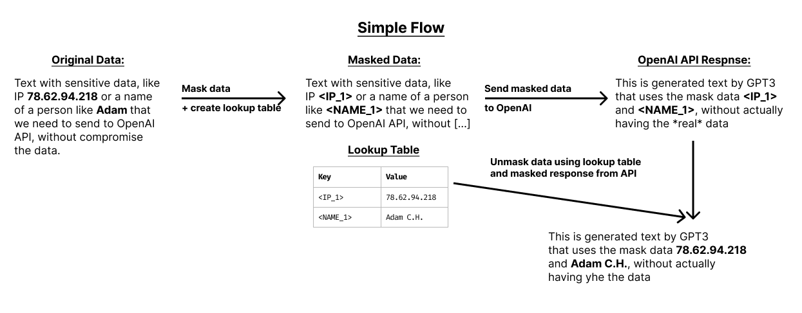

# masked-ai
Masked Python SDK wrapper for OpenAI API. Use public LLM APIs securely by reducing sensetive data before sending requests to OpenAI api, and then construct the data back before presenting to the user.



## How to use

#### CLI:
Download the binary and run:
```
maskedai --
```
And here is how you can use `masked-AI` CLI with OpenAI API:
```
curl https://api.openai.com/v1/chat/completions \
 -H "Authorization: Bearer $OPENAI_API_KEY" \
 -H "Content-Type: application/json" \
 -d '{
 "model": "gpt-3.5-turbo",
 "messages": [{"role": "user", "content": "What is the OpenAI mission?"}] 
 }'
```

#### Python:
```python
from masked_openai import Masker

data = "Text with potential sensitive data"

masker = Masker(data)
respinse = openai(masker.masked())
```


## How to contribute:


## License
This is licensed under the GPL. Please contact us if this does not work for your use case - we may be able to alternatively license under a non-copyleft license such as the Apache License. We're friendly! As this software is licensed under the GPL and used in our commercial product, we ask any contributors to sign a simple Contributor License Agreement (CLA).
